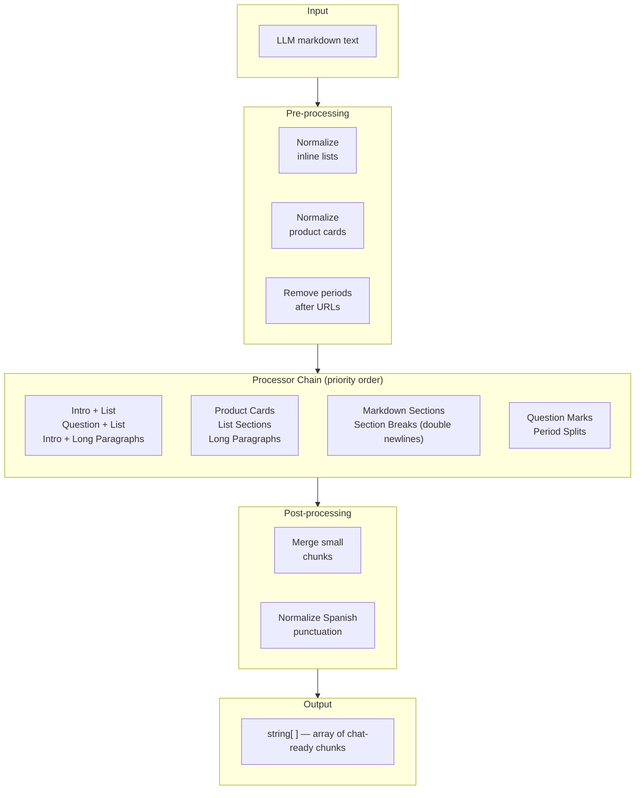

<p align="center">
  <h1 align="center">LLM Markdown WhatsApp</h1>
  <p align="center">
    A TypeScript library that splits LLM-generated markdown into WhatsApp-friendly chat message chunks.
  </p>
</p>

<p align="center">
  <a href="https://www.typescriptlang.org/">
    
  </a>
  <a href="https://nodejs.org/">
    
  </a>
  <a href="https://opensource.org/licenses/MIT">
    
  </a>
</p>

<p align="center">
  <a href="#the-problem">Problem</a> •
  <a href="#quickstart">Quickstart</a> •
  <a href="#features">Features</a> •
  <a href="#splitting-rules">Splitting Rules</a> •
  <a href="#api-reference">API Reference</a>
</p>

---

## The Problem

LLMs generate long, structured markdown responses—paragraphs, numbered lists, product cards, nested bullet points. Sending these as a single WhatsApp message creates a wall of text that users won't read.

Naively splitting at character limits breaks mid-sentence, mid-list, or mid-URL. Splitting at every period creates fragmented messages that feel robotic. Neither approach understands the structure of the content.

Additionally:

- **URLs, emails, and numbers contain periods.** Splitting at `Nike.com.co` or `$1.000.000` or `juan.perez@gmail.com` produces broken fragments.
- **Lists should stay together.** A numbered list of products or a bullet list of options is a single logical unit—splitting inside an item destroys readability.
- **Questions need context.** A short trailing question like "¿Te interesa?" should stay attached to the preceding sentence, not become its own tiny message.

This library handles all of this. One function call, zero configuration. Pass in the LLM's markdown output, get back an array of WhatsApp-ready message chunks.

## How It Works

The library takes a markdown string and splits it into an array of smaller chunks optimized for chat readability. It applies a priority-ordered chain of processors:

1. Pre-processes text (normalizes inline lists, removes periods after URLs)
2. Tries structural splits first (intro + list, product cards, markdown sections, double newlines)
3. Falls back to semantic splits (question marks, periods) with intelligent protection
4. Merges chunks that are too small (<20 chars) with their neighbors
5. Normalizes Spanish punctuation (¿/¡ capitalization rules)

## Features

| Feature                       | Description                                                                    |
| ----------------------------- | ------------------------------------------------------------------------------ |
| **Smart Question Splitting**  | Splits at question marks while keeping contiguous questions together            |
| **List Preservation**         | Keeps numbered and bullet lists intact, splits only when items are very long    |
| **Product Card Detection**    | Recognizes product card patterns (with emojis or markdown) and splits per card  |
| **URL/Email/Number Safety**   | Never splits inside URLs, emails, domain names, or formatted numbers           |
| **Parentheses Protection**    | Avoids splitting inside parenthetical expressions                              |
| **Abbreviation Awareness**    | Protects periods in `etc.`, `Dr.`, `D.C.`, `S.A.`, version numbers            |
| **Spanish Punctuation**       | Normalizes capitalization after mid-sentence ¿ and ¡ marks                     |
| **Small Chunk Merging**       | Prevents tiny fragments by merging small chunks with adjacent ones             |
| **Markdown Section Support**  | Splits at markdown headers (`*Title*` or `_Title_`) as natural boundaries      |
| **Zero Configuration**        | Single function, no setup required—just pass text, get chunks                  |

## Architecture



---

## Quickstart

```bash
npm install @llm-markdown-whatsapp/core
```

### Basic Usage

```typescript
import { splitChatText } from '@llm-markdown-whatsapp/core';

const llmResponse = 'Gracias por contactarnos. Entiendo tu situación y quiero ayudarte a resolverla de la mejor manera. Puedes enviar tu producto de vuelta sin costo adicional. ¿Prefieres un reembolso completo o un intercambio por otro modelo?';

const chunks = splitChatText(llmResponse);
// [
//   'Gracias por contactarnos.',
//   'Entiendo tu situación y quiero ayudarte a resolverla de la mejor manera.',
//   'Puedes enviar tu producto de vuelta sin costo adicional.',
//   '¿Prefieres un reembolso completo o un intercambio por otro modelo?',
// ]

// Send each chunk as a separate WhatsApp message
for (const chunk of chunks) {
  await sendWhatsAppMessage(chunk);
}
```

### Lists Stay Together

```typescript
const llmResponse = `Encontré estas opciones:

- Nike Pegasus Plus – Zapatillas de alto rendimiento para maratones y running, con amortiguación ZoomX Foam y parte superior Flyknit que se adapta al pie. Disponibles en negro y en una combinación multicolor.
- Nike Air Max 90 – Modelo clásico con suela tipo waffle y la icónica amortiguación Air visible, en tonos neutros como hueso claro/oliva/gris universitario.
¿Cuál de estos modelos te interesa más? 😊`;

const chunks = splitChatText(llmResponse);
// [
//   'Encontré estas opciones:',
//   '- Nike Pegasus Plus – Zapatillas de alto rendimiento para maratones...',
//   '- Nike Air Max 90 – Modelo clásico con suela tipo waffle...',
//   '¿Cuál de estos modelos te interesa más? 😊',
// ]
```

### Product Cards Split Per Card

```typescript
const llmResponse = `Encontré estas opciones:

1. 🛍️  Zapatillas Pegasus Plus: 💵 $1.015.000
📏 Color: Negro, Azul glacial/Espuma menta/Verde impacto/Negro.
📏 Talla Calzado: 43, 41, 38.
✅ Ultraligeras, con amortiguación ZoomX y gran transpirabilidad.

2. 🛍️  Zapaillas ISPA Sense: 💵 $804.900
📏 Talla Calzado: 38, 39, 40, 41, 42, 43.
✅ Estilo casual con buena comodidad para uso diario.

¿Cuál de estos productos te gusta?`;

const chunks = splitChatText(llmResponse);
// [
//   'Encontré estas opciones:',
//   '🛍️  Zapatillas Pegasus Plus: 💵 $1.015.000\n📏 Color: ...\n✅ Ultraligeras...',
//   '🛍️  Zapaillas ISPA Sense: 💵 $804.900\n📏 Talla Calzado: ...\n✅ Estilo casual...',
//   '¿Cuál de estos productos te gusta?',
// ]
```

---

## Splitting Rules

The library applies processors in priority order. The first processor that finds a valid split point wins, and the remaining text is re-evaluated from the top.

### Structural Splits (highest priority)

| Pattern                    | Behavior                                                                             |
| -------------------------- | ------------------------------------------------------------------------------------ |
| **Intro + List**           | Text ending with `:` followed by a numbered/bullet list splits after the intro       |
| **Question + Numbered List** | Short question followed by numbered options stays together as one chunk             |
| **Product Cards**          | Numbered items with `🛍️` or `*Title*` formatting split into one chunk per card       |
| **List Sections**          | Numbered/bullet lists kept as one chunk; split per-item only when items are >150 chars |
| **Markdown Sections**      | `*Header*` or `_Header_` with content splits at section boundaries                   |
| **Section Breaks**         | Double newlines (`\n\n`) act as natural split points                                 |

### Semantic Splits (fallback)

| Pattern                    | Behavior                                                                             |
| -------------------------- | ------------------------------------------------------------------------------------ |
| **Question Marks**         | Splits after `?` unless followed by lowercase (sentence continuation) or emoji       |
| **Contiguous Questions**   | Multiple questions without periods between them stay together                        |
| **Period Splits**          | Splits at `.` for text >100 chars, skipping protected positions                      |

### Protected Content (never split inside)

| Content                    | Examples                                                                             |
| -------------------------- | ------------------------------------------------------------------------------------ |
| **URLs**                   | `https://example.com/path`, `www.site.com`                                           |
| **Plain Domains**          | `Nike.com.co`, `shop.example.co.uk`                                                  |
| **Emails**                 | `juan.perez@gmail.com`                                                               |
| **Formatted Numbers**      | `$1.000.000`, `2.5.1`, `15.5`                                                       |
| **Abbreviations**          | `etc.`, `Dr.`, `D.C.`, `S.A.`, `E.U.A.`                                             |
| **Parenthetical Expressions** | `(calle, número, referencia, etc.)`                                               |
| **Bullet Point Content**   | Content within `- item` or `• item` lines                                            |

### Post-processing

- **Small Chunk Merging:** Chunks under 20 characters merge with the next chunk (or previous, if last).
- **Spanish Punctuation:** After mid-sentence `¿` or `¡` (not at start or after `.`/`!`/`?`), the following letter is lowercased. Example: `ayudarte ¿Cómo estás?` becomes `ayudarte ¿cómo estás?`.

---

## API Reference

### `splitChatText(text)`

```typescript
function splitChatText(text: string | null | undefined): string[]
```

Splits a markdown text string into an array of chat-ready chunks.

- **Input:** A string of markdown text (typically an LLM response). Accepts `null` or `undefined` safely.
- **Output:** An array of strings, each suitable for sending as an individual WhatsApp message.
- Returns `[]` for `null`, `undefined`, or empty string.

```typescript
import { splitChatText } from '@llm-markdown-whatsapp/core';

const chunks = splitChatText(llmMarkdownText);
```

## Project Structure

```
llm-markdown-whatsapp/
├── packages/
│   └── core/                    # Core splitting library
│       └── src/
│           ├── index.ts         # Public API — exports splitChatText
│           └── chatSplit/
│               ├── splitChatText.ts          # Main orchestrator
│               ├── splitProcessors.ts        # Intro + list processors
│               ├── productCardProcessor.ts   # Product card detection and splitting
│               ├── listProcessor.ts          # Numbered/bullet list processing
│               ├── paragraphProcessor.ts     # Long paragraph and markdown sections
│               ├── breakProcessor.ts         # Double newline section breaks
│               ├── questionProcessor.ts      # Question mark splitting logic
│               ├── periodProcessor.ts        # Period splitting with protected ranges
│               ├── mergeProcessor.ts         # Small chunk merging
│               ├── sections.ts              # Markdown/list section detection
│               ├── textHelpers.ts           # Smart trim, emoji detection, text utilities
│               ├── positionHelpers.ts       # Parentheses/bullet position checks
│               ├── listNormalization.ts     # Inline list normalization
│               ├── urlNormalization.ts       # URL period removal
│               ├── punctuationNormalization.ts  # Spanish ¿/¡ capitalization
│               ├── constants.ts             # Threshold constants
│               └── splitConstants.ts        # Split-specific constants
└── README.md
```

## Contributing

Contributions are welcome! Please:

1. Fork the repository
2. Create a feature branch (`git checkout -b feature/amazing-feature`)
3. Write tests for your changes
4. Ensure all tests pass (`npm test`)
5. Ensure types check (`npm run typecheck`)
6. Commit with a clear message
7. Open a Pull Request

## Development

```bash
git clone <repository-url>
cd llm-markdown-whatsapp
npm install

npm run build          # Build all packages
npm test               # Run tests
npm run typecheck      # Type check
npm run lint           # Lint
npm run check          # Format + lint + typecheck
```

## License

MIT License - see [LICENSE](LICENSE) for details.

---

<p align="center">
  Built with TypeScript • Zero Dependencies • WhatsApp-Optimized Chat Splitting
</p>
